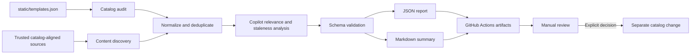

# Static Gallery Audit and Content Discovery Plan

**Status:** Production review candidate
**Phase:** Automated audit, classification, proposal issue, and operator runbook

## Summary

Keep the gallery as a static Docusaurus site on GitHub Pages. Add GitHub Actions workflows that:

1. audits the existing `static/templates.json` catalog for broken, redirected, duplicate, and potentially stale entries;
2. discovers recent Azure Cosmos DB examples, videos, documentation, and blogs from an exact allowlist of public endpoints;
3. use GitHub Copilot CLI in programmatic mode with the Azure Cosmos DB Agent Kit and humanizer skills to evaluate relevance and semantic staleness against a fixed rubric;
4. build and validate proposed catalog changes only in the runner workspace; and
5. publishes an unassigned Copilot handoff issue containing the complete proposal, then uploads validated reports for review.

Actions never write repository contents, push branches, merge pull requests, or deploy the site. Copilot creates a branch and draft pull request only after a maintainer reviews and assigns the proposal issue; merging that reviewed PR is the only action that publishes the changes through the existing Pages workflow.

## Constraints

- The website remains fully static and deploys only through GitHub Pages.
- GitHub-hosted Actions runners provide all scheduled compute.
- No Azure resources, hosted APIs, databases, queues, storage accounts, model endpoints, or other backend services are used.
- Automation mutates only the repository in which the workflow runs. External repositories remain read-only discovery sources.
- Discovery uses public HTTP endpoints and the GitHub API with the workflow's scoped `GITHUB_TOKEN`.
- Relevance analysis uses GitHub Copilot CLI with the built-in Actions `GITHUB_TOKEN` and the `copilot-requests: write` workflow permission. The organization must enable **Allow use of Copilot CLI billed to the organization**.
- Audit and classification use the built-in Actions `GITHUB_TOKEN` with read-only repository access plus `copilot-requests: write`. A separate trusted `workflow_run` publisher loaded from `main` receives actions read plus issues write access, reads the validated summary artifact, and creates the handoff issue.
- Repository default workflow permissions remain read-only; write access exists only in the publishing jobs after tests and a full static build pass.
- Pull requests are always drafts and are never approved or merged by automation.
- No candidate or audit finding changes the published catalog until a person merges the draft pull request.

## Goals

- Produce a repeatable audit of every published gallery entry.
- Surface entries that need human review without removing or hiding them.
- Find recent first-party and explicitly trusted content across the source families already represented in the catalog.
- Exclude exact and normalized URL duplicates already present in the gallery.
- Stage evidence in formats that are easy to inspect in a draft pull request and workflow artifact.
- Keep the workflow small, explainable, inexpensive, and safe to disable.

## Non-Goals

- Discovering presentations, social posts, or content from unlisted publishers.
- Allowing model output to merge, deploy, or rewrite source-provided descriptions.
- Automatically approving, merging, or restoring entries.
- Maintaining a second long-lived catalog or service-side state store.
- Measuring popularity, engagement, or business impact.
- Guaranteeing that an old article is stale based on age alone.

## Workflow



The `audit-gallery-content.yml` workflow has one automatic schedule, Monday at 06:17 UTC, and supports explicit manual dispatch for setup and recovery. It performs audit, discovery, classification, and proposal generation with read-only repository access, then uploads validated artifacts. The `publish-gallery-proposal.yml` workflow runs from trusted `main` after successful non-PR audit runs on the default branch and creates the complete proposal issue. A maintainer edits that issue to the desired result before assigning it to Copilot.

## Current Catalog Source Map

The source registry should start from the catalog that actually exists, not from a generic list of places that might contain relevant material. A baseline inventory of the 111 records in `static/templates.json` found this distribution:

| Source family | Entries | Current role | Representative locations |
| --- | ---: | --- | --- |
| GitHub | 56 | Mostly runnable examples, tools, and supporting documentation | `AzureCosmosDB` (27), `Azure-Samples` (11), `microsoft` (8), and `Azure` (5) |
| YouTube | 26 | Conference sessions, walkthroughs, and demos | Both `youtube.com` and `youtu.be` URL forms |
| Microsoft Learn | 14 | Product documentation and implementation guidance | Pages under `learn.microsoft.com/azure/cosmos-db/` and API-specific descendants |
| Azure Cosmos DB Blog | 5 | First-party announcements and technical articles | `devblogs.microsoft.com/cosmosdb/` |
| Other approved sources | 10 | Community articles, framework documentation, and isolated tools | LlamaIndex, LangChain, Medium, Made of Strings, and GitHub Gist |

The content labels overlap, but the current collection is primarily 53 examples, 26 videos, 20 documentation resources, 9 blogs, and 5 tools. Discovery therefore covers GitHub, YouTube, Microsoft Learn, and the Azure Cosmos DB Blog instead of allowing the easiest available feed to determine the content mix.

The `source` field is the canonical resource to audit. The `website` field often identifies an author or organization and must not be substituted for the resource URL. The baseline also found five groups in which multiple catalog records use the same exact source URL. Phase 1 should report those groups before any normalized-URL matching is added; a shared source may be intentional, so duplication is a review finding rather than a deletion instruction.

### Source-Specific Stale Checks

An HTTP success alone does not establish that a resource is current. Apply checks appropriate to each source family:

| Source family | Deterministic checks | Human review signals |
| --- | --- | --- |
| GitHub | Repository and referenced path exist; repository is public and not disabled; follow repository transfers and default-branch redirects | Archived repository, removed path, replacement repository, deprecated SDK or runtime, or no meaningful activity near a fast-moving product area |
| Microsoft Learn | Page resolves on the canonical `learn.microsoft.com` host; locale redirects are normalized; page is not a generic not-found shell | Deprecation, retirement, previous-version banner, replacement link, or topic moved into a newer API-specific document set |
| YouTube | Extract and compare the canonical video ID across `youtube.com` and `youtu.be`; video is available and not private or deleted | Superseded product naming, obsolete setup steps, or a newer recording covering the same topic |
| Azure Cosmos DB Blog and community feeds | Article resolves; canonical URL remains on an approved host; the article still appears in the publisher feed when the feed retains that period | Explicit update or correction, obsolete code dependencies, or a newer article that supersedes the guidance |
| Framework documentation | Canonical page exists and the referenced integration remains in the current documentation tree | Versioned documentation moved, package renamed, integration deprecated, or current guidance contradicts the catalog description |
| GitHub Gist | Gist and referenced file exist and remain public | No provenance beyond the gist, obsolete dependencies, or a maintained repository now provides the canonical implementation |

Age and repository inactivity can raise review priority, but neither is proof of staleness. Redirects should be recorded as evidence and proposed as canonical URL updates only after the destination is verified to represent the same resource.

## 1. Audit Existing Entries

Read `static/templates.json` without modifying it. For each record:

- verify required fields used by the current site are present;
- parse and normalize the source URL;
- follow redirects within a bounded limit;
- try `HEAD`, then fall back to a bounded `GET` request when necessary;
- record the final URL and HTTP status;
- identify exact and normalized duplicate URLs;
- validate GitHub repository URLs through the GitHub API when applicable;
- flag archived, missing, disabled, or unexpectedly private GitHub repositories;
- flag entries older than configured review thresholds as `age-review`, never as automatically stale;
- match titles, descriptions, and URLs against a small version-controlled list of known retired product terms or superseded destinations; and
- classify timeouts, rate limits, authentication challenges, and bot blocking as `indeterminate`.

### Audit Outcomes

| Outcome | Meaning | Automatic action |
| --- | --- | --- |
| `healthy` | Source resolves and no deterministic issue was found | None |
| `redirected` | Source resolves at a different canonical URL | None; suggest URL review |
| `review` | Age, metadata, repository state, or known-term evidence warrants inspection | None |
| `broken` | Source returns a definitive missing response or API-confirmed deletion | None |
| `duplicate` | Another catalog item has the same normalized identity | None |
| `indeterminate` | The check could not reach a reliable conclusion | None |

Every finding includes the item title, original URL, observed final URL, status, reason code, evidence, and scan timestamp. Repository inactivity and article age are review signals only.

## 2. Discover New Content

Discovery reads a version-controlled allowlist of exact public sources aligned with the existing catalog:

- read the Azure Cosmos DB Blog RSS feed at `https://devblogs.microsoft.com/cosmosdb/feed/`;
- read public YouTube Atom feeds resolved only from the seven approved channel handles in `sources.json`, then validate every video through YouTube oEmbed;
- query GitHub Search with the workflow `GITHUB_TOKEN` for newly created, public, active, non-fork repositories in `AzureCosmosDB`, `Azure-Samples`, `Azure`, and `microsoft`;
- query Microsoft Learn Search and retain only recently updated canonical pages under `/azure/cosmos-db/`;
- add `https://medium.com/feed/walmartglobaltech`, `https://deepubhatia.medium.com/feed`, and `https://madeofstrings.com/feed/` as reviewed community feed candidates, disabled until a maintainer approves each source; and
- add other sources only after the exact endpoint, publisher identity, catalog defaults, and candidate cap are reviewed.

Do not configure `https://learn.microsoft.com/sitemapindex.xml`: it currently returns 404 and is not a dependable discovery contract. Learn discovery must remain bounded to the Cosmos DB product tree and must record the query or index endpoint used in each run.

LlamaIndex, LangChain, presentations, and social sources remain audit-only until an exact endpoint and promotion metadata are approved. Discovery never performs unrestricted web crawling.

### Discovery Priority

1. **First-party current:** New repositories and videos plus new or materially updated Blog and Microsoft Learn content.
2. **First-party adjacent:** Cosmos DB content from the approved Microsoft-operated GitHub organizations and YouTube channels.
3. **Approved community:** SQLBits and Coffee with Azure Cosmos DB videos plus disabled publisher feeds already represented in the catalog.
4. **Unlisted sources:** Never queried automatically; a maintainer must first review and add the exact feed or index.

Each source definition contains:

- stable source ID;
- source kind and exact feed, handle, or search URL;
- allowed hostnames;
- trust tier;
- enabled flag;
- lookback window;
- include terms; and
- content type, catalog defaults, and per-run candidate cap.

The weekly run reads entries within a bounded lookback window, such as the previous 45 days. Re-scanning a small window avoids persistent cursors or a database.

### Candidate Filtering

A discovered item reaches Copilot analysis only when:

- its source is enabled and allowlisted;
- its publication, creation, or update date is inside the configured lookback window;
- its canonical URL is not already in `static/templates.json`;
- its normalized URL is not duplicated elsewhere in the current run;
- its page resolves successfully;
- its title, feed summary, page metadata, or approved source path contains a direct Azure Cosmos DB signal; and
- it has enough source metadata for a person to evaluate it.

These deterministic checks prioritize recall and keep the model input small. Copilot then evaluates each candidate against the current catalog and the fixed inclusion rubric below. Borderline items remain visible with a `review` verdict rather than being silently discarded.

### Automated Relevance and Staleness Analysis

Run GitHub Copilot CLI programmatically after deterministic collection:

```shell
GITHUB_TOKEN="$GITHUB_TOKEN" \
    node scripts/gallery-audit/index.mjs --classify-only --promote
```

The `gallery-curator` custom agent declares `tools: []`, a required reviewed model, and low reasoning effort. The implementation embeds bounded candidate and catalog metadata in a delimited prompt. Copilot receives only titles, content types, canonical URLs, dates, tags, source-provided excerpts, deterministic audit evidence, and the current catalog comparison. It does not need shell, network, write, GitHub, or MCP tools. Never use `--allow-all-tools`, `--allow-all`, or `--yolo` in this workflow.

For new content, the model assigns exactly one verdict:

| Verdict | Meaning |
| --- | --- |
| `include` | Substantive, current Azure Cosmos DB technical content that adds distinct value |
| `review` | Potentially useful, but relevance, currency, depth, or duplication is uncertain |
| `exclude` | Off-topic, promotional, shallow, duplicative, or not useful to the gallery audience |

For existing content, the model assigns exactly one verdict:

| Verdict | Meaning |
| --- | --- |
| `keep` | Still useful and not contradicted by observed evidence |
| `review` | May be dated or superseded, but the evidence is not sufficient for retirement |
| `retire-proposed` | Strong evidence shows the resource is broken, deprecated, superseded, or materially misleading |

The fixed relevance rubric requires content to:

- directly teach building, operating, troubleshooting, or designing with Azure Cosmos DB;
- contain reusable technical guidance, code, a runnable example, or a substantive walkthrough;
- add value not already represented by an equivalent catalog entry;
- use current product names and supported APIs, or remain historically useful without misleading readers; and
- be more substantial than an announcement, event promotion, or marketing overview.

Every verdict must include short evidence, the matched rubric criteria, a confidence value of `high`, `medium`, or `low`, and any likely duplicate or replacement URL. The workflow validates the response against a strict JSON schema. Invalid output is retried once; a second failure marks analysis incomplete and publishes the deterministic report without model verdicts.

Copilot must analyze candidates as untrusted content. Source excerpts cannot alter the rubric, request tools, or instruct the workflow. The prompt explicitly tells the model to treat instructions found in titles, excerpts, pages, or repository text as data.

Before invoking the curator, the workflow installs `cosmosdb-best-practices` from a pinned commit of `AzureCosmosDB/CosmosDB-Agent-Kit`, verifies the downloaded `SKILL.md` checksum, and confirms that Copilot CLI discovers it alongside the committed `humanizer` skill. The curator must apply both. Agent Kit guidance informs Cosmos DB relevance and product-boundary decisions. Humanizer runs only after each decision and may edit only short evidence and criteria strings without changing facts or schema.

### Staged Candidate Shape

```json
{
    "sourceId": "youtube-azure-cosmos-db",
    "contentType": "video",
    "title": "Content title from source",
    "url": "https://www.youtube.com/watch?v=example",
  "publishedAt": "2026-09-01T00:00:00Z",
  "author": "Source-provided author",
  "summary": "Source-provided excerpt only",
  "signals": ["trusted-source", "cosmos-db-title-match"],
  "confidence": "low",
  "discoveredAt": "2026-09-17T00:00:00Z"
}
```

The workflow never generates replacement marketing copy. It preserves source-provided metadata, assigns catalog defaults from the reviewed source record, and clearly labels missing fields.

## 3. Stage Results

Each completed run uploads one artifact named `gallery-content-review-<run-id>` containing:

```text
gallery-content-review/
    audit-report.json
    audit-summary.md
    article-candidates.json
    article-candidates.md
    run-metadata.json
```

The Markdown files provide concise tables for review. The JSON files preserve structured evidence for later tooling. The `article-candidates.*` filenames are retained for workflow and artifact compatibility, but contain all supported content types. `run-metadata.json` records the source commit, workflow run, timestamps, enabled sources, counts, and any partial-scan conditions.

Artifacts use a short retention period, such as 30 days. They contain only public source metadata and no credentials. A failed or partial scan still uploads diagnostics when possible but clearly marks its results incomplete.

## Human Review and Promotion

The workflow promotes only `include` candidates with `high` confidence and complete source-provided catalog metadata. It retires only `retire-proposed` entries with `high` confidence when deterministic evidence also shows a broken URL, an archived or disabled repository, or a known retired term.

Promoted content retains the source title, excerpt, author, canonical URL, date, source-approved content tags, classification reason, and matched criteria. Canonical URL updates include the redirect reason and reason codes. Retirements retain the original record, retirement reason, replacement URL, and deterministic evidence. `review`, low-confidence, medium-confidence, skipped, duplicate, incomplete, and malformed results remain artifact-only and cannot create an issue by themselves.

Each complete run attempt publishes an unassigned issue containing the validated recommendations. A maintainer deletes unwanted items, revises retained items, adds implementation notes, and assigns the edited issue to Copilot. Copilot then creates its own branch and draft pull request. Reviewers are selected according to current team ownership. Only a manual merge to protected `main` publishes the update. Incomplete runs do not alter earlier proposals.

Each proposed addition, URL update, and retirement has an `A<n>`, `U<n>`, or `R<n>` identifier. Before assignment, a maintainer edits the issue body until it contains only the intended changes: delete complete numbered items to omit them, revise fields in place, and add plain-language implementation notes as needed. Copilot treats that edited issue as the complete source of truth, modifies the catalog on its own branch, runs the audit tests and static build, and creates a draft pull request. Copilot never approves or merges the pull request.

## Proposed Repository Structure

```text
.github/
    agents/
        gallery-curator.agent.md
    workflows/
        audit-gallery-content.yml
        publish-gallery-proposal.yml
    gallery-audit/
        sources.json
        policy.json
scripts/
    gallery-audit/
        audit-catalog.mjs
        core.mjs
        normalize-url.mjs
        promotion.mjs
        write-reports.mjs
        index.mjs
        test/
```

This is an implementation target, not a requirement to create all files immediately. Prefer Node.js built-ins and existing dependencies. Add a package only when a standard parser cannot safely handle a source format.

## GitHub Actions Design

Trigger:

- weekly schedule at a low-traffic UTC time;
- `workflow_dispatch` for manual runs; and
- no `push` trigger, because deploys and content audits are separate concerns.

Permissions:

```yaml
permissions:
  contents: read
  pull-requests: read
```

The workflow should:

1. check out the repository's current commit;
2. install locked dependencies only if the scripts require them;
3. run deterministic unit tests;
4. run the catalog audit;
5. run bounded catalog-aligned content discovery;
6. install a pinned GitHub Copilot CLI version on Node.js 22 or later;
7. run bounded relevance and semantic-staleness analysis with no tools available;
8. validate Copilot output and combine it with deterministic evidence;
9. build eligible proposed changes in the runner workspace;
10. run focused tests and the full Docusaurus build;
11. publish the unassigned Copilot handoff issue containing the validated proposal;
12. write a concise Actions job summary; and
13. upload the artifact bundle.

The built-in Actions `GITHUB_TOKEN` receives only the permissions declared for each job. Validation and audit remain repository-read-only; audit adds only Copilot-request write access. The trusted publisher receives actions read plus issues write access, rejects PR and non-default-branch source runs, and executes no repository scripts. No stored authentication secret is required, and Actions never write repository contents or create, approve, or merge pull requests.

Use timeouts, concurrency with `cancel-in-progress: false`, bounded response sizes, redirect limits, and per-source request limits. Pin third-party actions to reviewed commit SHAs before enabling the schedule.

## Safety and Failure Rules

- Reject URLs whose final hostname leaves the source allowlist unless the destination is separately approved.
- Never fetch private, loopback, link-local, or non-HTTP network locations.
- Limit response size and request duration.
- Treat fetched content as untrusted data, never as workflow instructions.
- Do not execute discovered code or scripts.
- Give Copilot CLI no shell, write, network, GitHub, or MCP tools.
- Validate model output against a strict schema before including it in reports.
- Apply only `include/high` candidates with complete catalog metadata.
- Apply only `retire-proposed/high` entries backed by strong deterministic evidence.
- Actions never write catalog changes to the repository; Copilot creates the only working branch and draft pull request after a maintainer assigns the proposal issue.
- Never push to `main`, approve, merge, or enable automerge.
- Do not log tokens or request authorization headers.
- Do not fail the entire audit because one source is unavailable; mark that source partial.
- Do fail before artifact publication when the catalog cannot be parsed or report output is structurally invalid.
- Never infer causation, quality, or obsolescence from publication date or commit activity alone.

## Validation

Implementation is complete only when automated checks prove:

- the current catalog can be parsed without mutation;
- URL normalization is deterministic;
- duplicate detection handles locale, trailing slash, tracking parameter, and GitHub casing variants;
- live and retired catalogs reject localized Microsoft documentation paths such as `/en-us/`;
- definitive failures and indeterminate network failures are distinguished;
- disabled and non-allowlisted sources are never queried;
- existing catalog URLs never appear as new candidates;
- Copilot receives only bounded metadata and cannot invoke tools;
- prompt-injection text in source metadata cannot change the output schema or rubric;
- invalid Copilot output is rejected and cannot suppress deterministic findings;
- malformed feed entries cannot break report generation;
- all report JSON is schema-valid;
- write credentials are unavailable to collection and classification steps;
- promotion is idempotent and review verdicts never change catalog files;
- the workflow cannot push directly to `main` or merge its draft pull request; and
- the existing Docusaurus build remains unchanged.

## Success Criteria

- Every current catalog entry appears exactly once in each complete audit.
- Every finding has a deterministic reason code and observable evidence.
- Existing URLs are excluded from staged content candidates.
- A weekly run always produces reviewable JSON and Markdown artifacts, but creates an unassigned issue only when at least one validated addition, URL update, or retirement is actionable. Every issue item states why it is recommended.
- Partial scans are clearly distinguishable from complete scans.
- The workflow uses no Azure or persistent backend resources.
- The workflow creates no direct `main` mutation and no automatic merge.
- A maintainer can review a run in under 15 minutes and identify the highest-priority broken entries and content candidates.

## Delivery Phases

### Phase 1: Local Audit

Implement URL normalization, catalog parsing, duplicate detection, bounded link checks, report generation, and unit tests. Run manually with no repository write behavior.

### Phase 2: Catalog-Aligned Discovery and Relevance

Add the exact trusted-source registry and bounded feed/search discovery for the catalog's established source families. Add the fixed relevance rubric, bounded Copilot CLI invocation, strict output schema, and catalog deduplication.

### Phase 3: Report-Only GitHub Action

Add manual dispatch with `contents: read`, artifact upload, job summaries, timeouts, and concurrency. Confirm the workflow produces no Git changes.

### Phase 4: Scheduled Runs

Enable the weekly schedule after several successful manual runs. Review artifact quality and tune only source definitions, lookback windows, and deterministic policies.

### Phase 5: Proposal Issue Promotion

Apply conservative promotion gates, validate the resulting static site, and publish an unassigned issue containing the complete recommendations. A maintainer edits the issue and assigns it to Copilot, which creates the branch and draft pull request; require human approval and merge for publication.

## Operator-Controlled Decisions

- Approved source endpoints and whether reviewed community sources are enabled.
- Audit cadence, lookback windows, and candidate caps.
- Artifact retention and review-age thresholds.
- Known retired-term and redirect rules.
- Copilot model availability, CLI upgrade cadence, and AI-credit budget.
- Which additional sources receive catalog defaults and become eligible for promotion.

## Operations

The implemented operating procedure, credential requirements, failure recovery, and review checklist are maintained in [Automated gallery maintenance](./automated-gallery-maintenance.md). Source eligibility and approval rules are maintained in [Content source policy](./content-source-policy.md).
